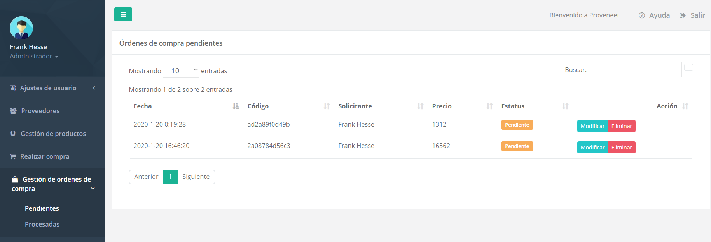
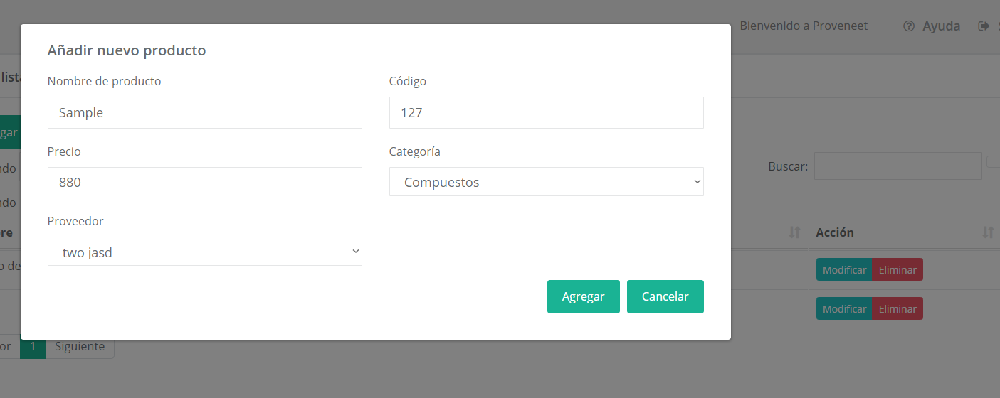

## Proveneet
>Software engineering project

<!-- TABLE OF CONTENTS -->
## Table of Contents

* [About the Project](#about-the-project)
  * [Built With](#built-with)
* [Getting Started](#getting-started)
  * [Prerequisites](#prerequisites)
  * [Installation](#installation)
* [Usage](#usage)
* [Roadmap](#roadmap)
* [Contributing](#contributing)
* [License](#license)
* [Contact](#contact)
* [Acknowledgements](#acknowledgements)


<!-- ABOUT THE PROJECT -->
## System characteristics

1. **User management:** Site admins must be able to add/modify/delete members since this app is intended as a closed website
2. **Provider management**: Users must be able to add/modify/delete providers
3. **Products management**: Users must be able to add/modify/delete products, as well as manage the available quantity in stock and make a purchase order (you do not purchase from the app, the app just keeps track of the orders you do)


### Built With

* [Bootstrap 4](https://getbootstrap.com/docs/4.4/getting-started/download/)
* [Javascript](https://www.javascript.com/try)
* [PHP 7](https://windows.php.net/download#php-7.3)
* [MySQL](https://www.mysql.com)


<!-- GETTING STARTED -->
## Getting Started

To get a local copy up and running follow these simple steps.

### Prerequisites

* [Install MySQL](https://dev.mysql.com/downloads/installer/)
* [Install PHP7](https://php.tutorials24x7.com/blog/how-to-install-php-7-on-windows)
* [Install XAMPP](https://www.apachefriends.org/es/index.html)

### Installation
 
1. Clone the repo
```sh
https://github.com/metalsonic21/IS-Proveneet.git
```

2. Move the project's folder in the path where you have xampp installed /htdocs. Example:
```sh
C:\\xampp\htdocs\IS-Proveneet
```

3. Execute XAMPP's control panel, initialize Apache and MySQL services
4. Create a MySQL user in `localhost/phpmyadmin` with the following credentials:
```
Username: FrankHesse
Password: proveneet
```
5. Create a MySQL database with that user, called `proveneet`
6. Go to either `localhost/IS-Proveneet/Login`, `127.0.0.1/IS-Proveneet/Login`, `localhost:80/IS-Proveneet/Login`
7. Go to the database structure, click on users and insert an user like this:
```sql
INSERT INTO users (nombre,apellido,username,clave,email,permisos) VALUES ('Frank','Hesse','FrankHesse',123456789,'hyperschnell11@outlook.sk','Administrador');
```
8. Log in from the app

<!-- USAGE EXAMPLES -->
## Usage



